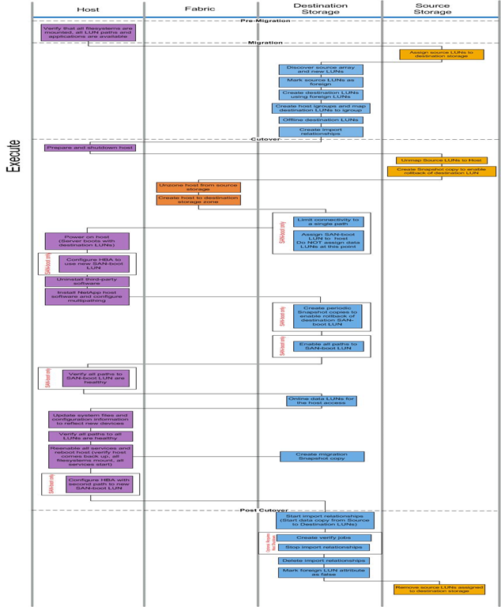

= Flux de travail de migration en ligne
:allow-uri-read: 
:icons: font
:imagesdir: ../media/

[role="lead"]
Le flux de travail de la migration en ligne est réalisé au cours de la phase d'exécution du processus de migration. Le schéma des workflows en ligne présente les tâches effectuées sur l'hôte, la structure, le stockage de destination et le stockage source.

Les tâches de workflow en ligne sont répertoriées dans le tableau suivant.

[cols="2*"]
|===
| Composant | Tâches 

 a| 
Hôte
 a| 
. Vérifiez que tous les systèmes de fichiers sont montés et que tous les chemins d'accès LUN et applications sont disponibles.
. *Facultatif :* si les LUN importés sont pour ESX, consultez et suivez les instructions de l'Annexe A : correction de l'ESX CAW/ATS.
. Préparation et arrêt des hôtes.
. Mettez les hôtes sous tension avec les LUN de destination.
. Configurez le HBA pour qu'il utilise une nouvelle LUN de démarrage SAN (démarrage SAN uniquement).
. Désinstaller MPIO tiers.
. Installation du logiciel hôte NetApp et configuration des chemins d'accès multiples
. Vérifiez que tous les chemins d'accès à la LUN de démarrage SAN sont en bon état (démarrage SAN uniquement).
. Mettez à jour les fichiers système et la configuration pour refléter les nouveaux périphériques.
. Vérifiez que tous les chemins vers toutes les LUN sont sains.
. Réactivez tous les services et redémarrez l'hôte (vérifiez que l'hôte est remis en service, que tous les systèmes de fichiers sont montés, que tous les services démarrent).
. Configurez le HBA avec le second chemin vers le nouveau LUN de démarrage SAN (démarrage SAN uniquement).

 a| 
Structure
 a| 
. Dézone l'hôte à partir du stockage source.
. Créer un hôte vers la zone de stockage de destination.

 a| 
Système de stockage de destination
 a| 
. Découverte des baies source et des nouveaux LUN
. Marquez les LUN source comme étant étrangères.
. Création de LUN de destination à l'aide de LUN étrangères
. Création des groupes initiateurs hôtes et mappage des LUN de destination sur un groupe initiateur.
. Hors ligne les LUN de destination.
. Supprimez les hôtes du masquage des LUN de la baie source (igroups).
. Créer des relations d'importation et lancer des travaux d'importation.
. Exécutez l'étape 4 ci-dessus (remappage des hôtes sur les nouveaux emplacements de LUN).
. Limitez la connectivité à un seul chemin (démarrage SAN uniquement).
. Attribuez la LUN de démarrage SAN à l'hôte ; n'attribuez pas de LUN de données à ce stade (démarrage SAN uniquement).
. Créez des copies Snapshot périodiques afin d'activer la restauration de la LUN de démarrage SAN de destination (démarrage SAN uniquement).
. Activez tous les chemins d'accès à la LUN de démarrage SAN (démarrage SAN uniquement).
. LUN de destination en ligne.
. Créer une copie Snapshot pour permettre la restauration de la LUN de destination
. Démarrer l'importation de relations (démarrer la copie des données des LUN source vers les LUN de destination)
. Créer des tâches de vérification et arrêter les relations d'importation (facultatif).
. Supprimer les relations d'importation.
. Marquez l'attribut de LUN étrangère sur false.

 a| 
Le stockage source
 a| 
. Attribuez des LUN source au stockage de destination.
. Annulez le mappage des LUN source à l'hôte.
. Créer une copie Snapshot pour permettre la restauration de la LUN de destination
. Supprimez les LUN source affectés au stockage de destination.

|===