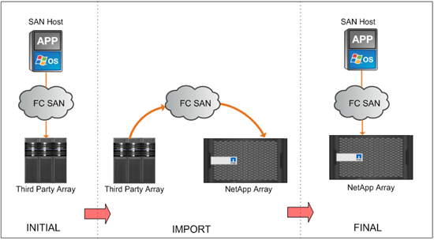

= Présentation de l'importation de LUN étrangères
:allow-uri-read: 
:icons: font
:imagesdir: ../media/

[role="lead"]
La fonctionnalité FLI (Foreign LUN Import) est une fonctionnalité intégrée dans ONTAP qui permet aux utilisateurs d'importer de manière simple et efficace des données depuis des LUN de baie étrangères vers des LUN NetApp.

Toutes les migrations FLI s'effectuent au niveau des LUN. FLI est un outil basé sur des blocs et qui ne prend donc pas en charge les migrations basées sur des fichiers, des enregistrements, NFS et CIFS. Pour connaître les autres méthodologies de migration des protocoles de niveau fichier, telles que NFS et CIFS/SMB, consultez la https://library.netapp.com/ecm/ecm_get_file/ECMP12363719["Référence rapide des outils de migration de données"].

FLI exploite la technologie NetApp FlexArray® pour découvrir les LUN de baies RAID étrangères et en extraire les données. FlexArray permet à un contrôleur NetApp ONTAP de jouer le rôle d'initiateur en amont d'une ou de plusieurs baies tierces. FlexArray peut monter des LUN à partir de ces baies comme stockage interne, puis présenter l'espace depuis ces LUN en tant que stockage unifié NetApp (permettant un accès aux protocoles FCP, FCoE, iSCSI, NFS et CIFS/SMB) vers des hôtes dans votre environnement SAN ou NAS.

FLI ne requiert aucune licence FlexArray. L'utilisation de la technologie FlexArray pour copier le LUN étranger sur une baie NetApp ONTAP, puis permettre aux hôtes et aux applications qui consomment cette LUN d'être pointé vers la baie NetApp qui héberge désormais le LUN en question. Bien que ONTAP ne nécessite plus de migration dans le cadre de ses services professionnels, NetApp recommande vivement l'implication des services professionnels dans l'évaluation, la planification et la formation pour toutes les migrations à l'exception des migrations les plus simples.

FLI a été développé pour migrer des LUN SAN vers ONTAP. FLI prend en charge diverses exigences de migration, notamment les exigences suivantes, mais sans s'y limiter :

* Migration des données entre des baies de stockage hétérogènes d'EMC, Hitachi, HP et d'autres fournisseurs vers NetApp, tel que pris en charge par la configuration FlexArray
* Simplification et accélération des migrations de données de blocs pendant le déplacement de data Center, la consolidation et le remplacement des baies
* Consolidation de la migration et des réalignements de LUN en un seul flux de travail.

De plus, la procédure de transition de 7-mode vers ONTAP peut être effectuée à partir d'agrégats 32 bits en agrégats 64 bits, corriger les problèmes d'alignement et migrer LES LUN comme une seule opération.

FLI permet au système de stockage NetApp de détecter les LUN à importer pour la migration des données. Les LUN étrangères sont affichées sous la forme de disques sur le stockage NetApp et n'ont pas de propriété leur attribuer automatiquement pour que les données utilisateur ne soient pas écrasées par erreur. Les disques qui contiennent des LUN de matrice étrangère doivent être marqués comme étant étrangers. Les règles de configuration des LUN de baies étrangères doivent être scrupuleusement respectées afin d'utiliser FLI pour le stockage NetApp. Voir la rubrique, xref:concept_lun_requirements_and_limitations.adoc[Exigences et limites des LUN].

FLI nécessite au moins un port FC physique sur chaque contrôleur et la migration directe des LUN en mode initiateur. Deux ports, un pour chaque matrice, sont préférables, mais un seul peut être utilisé. Ces ports servent à la connexion à la baie source et doivent être zonés et masqués afin de pouvoir voir et monter les LUN sources. Si vous devez modifier un port cible en port initiateur, consultez la section link:https://docs.netapp.com/us-en/ontap/san-admin/configure-fc-adapters-task.html["Configurer les adaptateurs FC"^] .

Les migrations FLI peuvent être effectuées hors ligne, ce qui perturbe les opérations pendant la durée de l'importation ou en ligne, ce qui est principalement sans interruption.

Cette figure représente une migration des données FLI hors ligne, où l'hôte est mis hors ligne pour la migration. La baie NetApp copie les données directement à partir de la baie tierce.

Cette figure illustre une migration des données en ligne FLI. L'hôte est connecté au contrôleur NetApp sur lequel le nouveau LUN est désormais hébergé. L'opération de l'hôte peut ensuite reprendre et continuer pendant l'importation.

image::../media/foreign_lun_import_overview_2.png[Présentation de la migration des données FLI]
