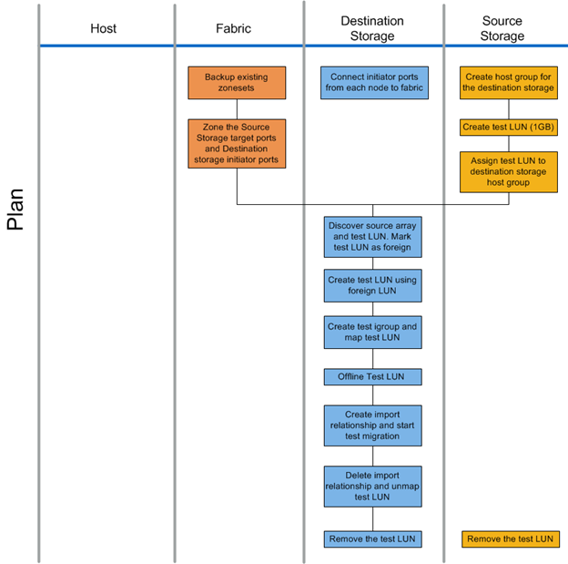

= Workflow de phase de planification
:allow-uri-read: 
:icons: font
:imagesdir: ../media/

[role="lead"]
La phase de planification du processus de migration des données se concentre sur les tâches nécessaires pour créer des plans de migration détaillés et s'assurer que tout est prêt pour la migration réelle. La majeure partie du travail de migration est la planification effectuée durant cette phase.

La phase de planification consiste à développer un plan de correction à l'aide des informations d'analyse de l'écart hôte recueillies lors de la phase d'analyse. Utiliser les informations de correction de l'hôte pendant la planification. Une fois la connectivité de bout en bout vérifiée, un test de migration est effectué pour s'assurer que tout est correctement configuré avant de procéder à la migration de production.

La figure suivante montre le flux de travail du plan.

Les tâches de la phase de planification sont répertoriées dans le tableau suivant.

[cols="2*"]
|===
| Composant | Tâches 

 a| 
Structure
 a| 
. Sauvegardez les zonesets existants.
. Zonage du stockage source vers le stockage de destination.

 a| 
Système de stockage de destination
 a| 
. Connectez les ports initiateurs à la structure.
. Découverte du stockage source et test de la LUN Marquez la LUN source comme étant étrangère.
. Créer une LUN test à l'aide d'une LUN étrangère.
. Créez un groupe initiateur de test et mappez la LUN de test.
. LUN test hors ligne.
. Création d'une relation d'importation et démarrage d'une migration de test.
. Supprimez la relation d'importation et annulez le mappage de la LUN de test.
. Retirez la LUN de test.

 a| 
Le stockage source
 a| 
. Créez un groupe d'hôtes pour le stockage de destination à l'aide des WWPN des ports initiateurs.
. Créez une LUN de test (1 Go).
. Attribuez (mapper/masquer) la LUN de test au groupe d'hôtes de stockage de destination.
. Retirez la LUN de test.

|===