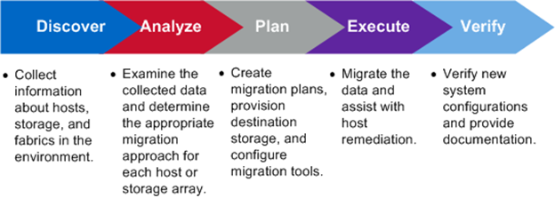

= Présentation du processus de migration
:allow-uri-read: 
:icons: font
:imagesdir: ../media/

[role="lead"]
Le processus de migration FLI est une méthodologie en cinq phases qui s'applique à toute migration de données : découverte, analyse, planification, exécution et vérification.

Ces phases fournissent une structure générale pour aider à identifier les tâches courantes effectuées tout au long du processus de migration. Les graphiques de cette section présentent les tâches pouvant être effectuées en parallèle dans chacun des quatre composants principaux : hôte, structure, stockage de destination et stockage source.
