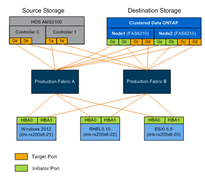

= Meilleures pratiques de câblage pour la migration FLI
:allow-uri-read: 
:icons: font
:imagesdir: ../media/

[role="lead"]
Pour configurer le stockage ONTAP pour la migration FLI, vous devez raccorder le système de stockage source à la structure en fonction de vos informations de planification et des meilleures pratiques recommandées.

Les meilleures pratiques en matière de câblage sont recommandées lors de la configuration du stockage ONTAP pour la migration FLI.

* Utilisez des structures doubles pour assurer la redondance.
* Utilisez au moins deux initiateurs et deux ports cibles depuis chaque système de stockage de destination pour la migration FLI.
* Ne pas segmenter les ports d'initiateur de stockage de destination avec l'hôte. Les ports initiateurs de ONTAP sont utilisés pour effectuer une zone avec les ports cibles du stockage source.

Voici un exemple de câblage pour le stockage source et de destination dans une structure de production.

