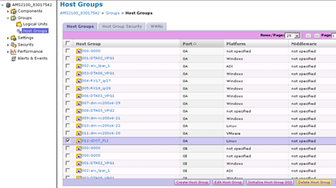

= Suppression de la configuration de la matrice de destination
:allow-uri-read: 
:icons: font
:imagesdir: ../media/

[role="lead"]
Les étapes suivantes montrent comment supprimer la configuration de la baie de destination de la baie source une fois la migration FLI terminée.

.Étapes
. Connectez-vous à Hitachi Storage Navigator Modular en tant que système.
. Sélectionnez matrice *AMS 2100* et cliquez sur *Afficher* et *configurer matrice*.
. Connectez-vous à l'aide de root.
. Développez groupes et sélectionnez *groupes d'hôtes*.
. Sélectionnez le groupe d'hôtes *cdot_FLI* et cliquez sur *Supprimer le groupe d'hôtes*.
+

. Confirmez la suppression du groupe hôte.
+
image::../media/remove_destination_array_configuration_from_source_array_2.png[suppression de la configuration du tableau de destination du tableau source]

