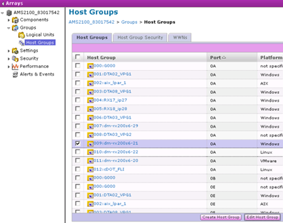
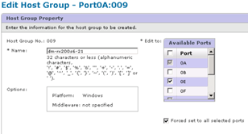

= Suppression des LUN source des hôtes
:allow-uri-read: 
:icons: font
:imagesdir: ../media/

[role="lead"]
La procédure suivante décrit la suppression des LUN source de votre hôte une fois la migration FLI terminée.

NOTE: Cette tâche utilise un tableau _HDS AMS2100_ dans les exemples. Vos tâches peuvent être différentes si vous utilisez un tableau différent ou une version différente de l'interface graphique de la baie.

Pour supprimer des LUN source de l'hôte, procédez comme suit :

.Étapes
. Connectez-vous à Hitachi Storage Navigator modulaire.
. Sélectionnez l'hôte migré et sélectionnez *Modifier le groupe d'hôtes*.
+

. Sélectionnez *ports* et sélectionnez *Forced Set* sur tous les ports sélectionnés.
+

. Sélectionnez les LUN hôtes qui sont migrés à partir des LUN logiques attribués. Utilisez les noms de LUN pour chaque hôte mentionné dans la fiche LUN source. Sélectionnez ici les LUN de l'hôte Windows 2012 et sélectionnez *Supprimer*.
+
image::../media/remove_source_luns_from_host_3.png[supprimer les lun source de l'hôte 3]

. Répétez les étapes pour les hôtes Linux et VMware ESX.

